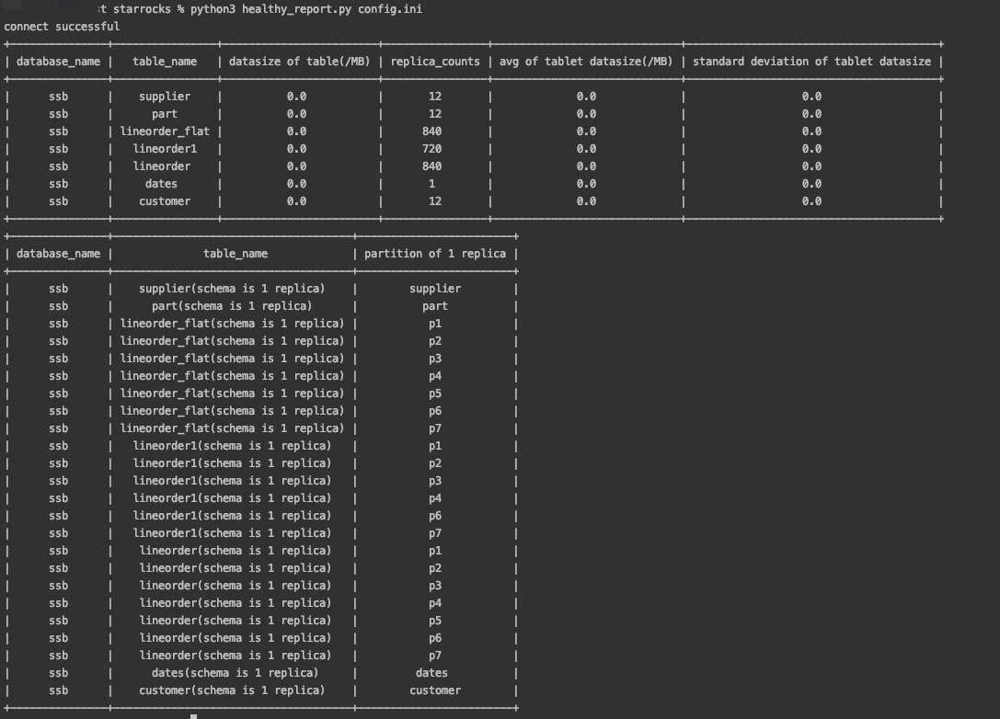

# health check for starrocks

## provide starrocks config
config.ini

## how to use

>default check tables of 1 replica

python healthy_report.py ./config.ini

>also you can check set replica to 3 as follows

python healthy_report.py ./config.ini 3

output example:

